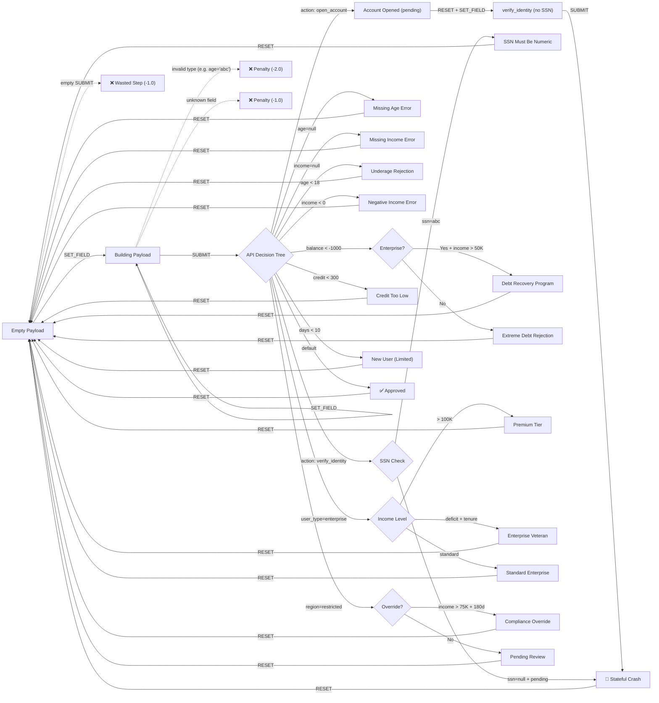

# Edge-Forge

**Stateful API fuzzing environment for the OpenEnv ecosystem.**

An RL environment where agents learn to discover bugs in a simulated loan-processing API by constructing payloads, managing session state, and exploring branching logic — things that random fuzzers can't do.

     

---

## Overview

Edge-Forge is an OpenEnv-compatible environment that wraps a mock loan-processing API with 19 code branches across 6 nested logic layers. The agent interacts through three actions — `SET_FIELD`, `SUBMIT`, and `RESET` — building payloads one field at a time and submitting them to trigger different API responses.

What makes it interesting as an RL problem:

- **State carries across submissions.** The API has internal state (e.g., account status transitions from `null` → `pending` → `active`). Some bugs only surface after a specific sequence of submissions — you can't find them in a single request.
- **The agent builds payloads incrementally.** It can only set one field per step, so assembling a valid payload takes multiple actions before each `SUBMIT`. Type mismatches (e.g., passing a string where an int is expected) incur penalties.
- **Coverage is the objective for one task.** The medium task scores the agent on how many unique API responses it can trigger out of 19 total, which requires systematic variation of inputs across multiple submit-reset cycles.
- **Grading is deterministic.** No LLM-as-judge. Graders check for exact API response strings in the episode's `submit_outcomes` list.

The environment exposes standard OpenEnv endpoints (`/reset`, `/step`, `/state`) and scores are clamped to `[0.01, 0.99]`.

---

## Why This Exists

Most code benchmarks evaluate agents on single-shot generation — write a function, check if it passes tests. Edge-Forge tests something different: can an agent explore a live system through repeated interactions, maintain context about what it's tried, and deliberately trigger failure modes?

The specific gap it fills: stateful, multi-step API exploration with a dense reward signal. The agent needs to remember that calling `open_account` puts the system in a `pending` state, and only *then* can it trigger the stateful crash by submitting `verify_identity` without an SSN. Random agents almost never discover this because it requires a specific 2-step sequence with the right fields omitted.

---

# 📊 How Edge-Forge Differs from Existing Benchmarks

| Benchmark Type | Steps     | Stateful Bugs | Branch Coverage | Type Penalties | State Transitions |
| -------------- | --------- | ------------- | --------------- | -------------- | ----------------- |
| HumanEval      | 1         | ❌            | ❌              | ❌             | ❌                |
| MBPP           | 1         | ❌            | ❌              | ❌             | ❌                |
| SWE-bench      | 1-3       | ❌            | Limited         | ❌             | ❌                |
| **Edge-Forge** | **15-30** | **✅**        | **✅**          | **✅**         | **✅**            |

## Key Limitations of Existing Benchmarks

**Single-Step Evaluation:** Most code benchmarks test whether generated code runs correctly. They don't test whether an agent can explore a system through multiple interactions.

**No Stateful Reasoning:** Existing benchmarks rarely require agents to maintain and reason about hidden system state across steps.

**No Coverage Objectives:** Real-world QA requires maximizing code path coverage, not just passing a single test case.

**No Penalty Dynamics:** Real fuzzing requires type-safe inputs. Sending malformed data should cost the agent, forcing careful construction.

## Edge-Forge Advantages

**Multi-Step Payload Construction:** Episodes span 15–30 steps, requiring agents to set fields, submit, observe, reset, and iterate.

**Stateful Crash Discovery:** The `hard_task` requires a specific two-step API sequence (`open_account` → `verify_identity` without SSN) that only crashes when internal state is `"pending"`.

**Branch Coverage Scoring:** The `medium_task` grades agents on how many of 19 distinct API response paths they discover, rewarding systematic exploration.

**Type Enforcement:** Invalid field types incur immediate `-2.0` penalties, teaching agents to respect schema constraints.

---

# 🧩 Environment Design

## Observation Space

Each step returns:

```python
class EdgeForgeObservation(Observation):
    last_status: int           # HTTP-like status: 200 (success), 500 (error)
    covered_branches: List[str]# Code branches discovered so far
    current_input: Dict        # Current payload being built by agent
    last_error: Optional[str]  # Error message if submission failed
    submit_outcomes: List[str] # Observable API response strings
```

The agent observes the direct outcome of its most recent step, accumulated coverage, and its current built-up payload. The environment is **partially observable** — the agent never sees internal `app_state` (e.g., `verification_attempts`) or logic thresholds (e.g., `enterprise_days` limits), forcing it to probe the system's boundaries through experimentation.

---

## Action Space

Discrete agent actions:

```
SET_FIELD  → Set a single field in the current payload (e.g., age=25)
SUBMIT     → Submit the current payload to the mock API
RESET      → Clear the current payload and start fresh
```

Each action mutates environment state. Because the agent can only `SET_FIELD` one property per step, assembling a complete payload takes several actions before a `SUBMIT`. This transforms dictionary manipulation into a multi-step MDP.

---

## State Transition Flow

The agent builds payloads and submits them through a 6-layer decision tree. The mock API maintains internal state across submissions. Invalid inputs are penalized.



**Valid Progressions:**

- Empty → SET_FIELD(age=25) → SET_FIELD(income=50000) → SUBMIT → Observe branch → RESET → Repeat with new inputs
- Empty → SET_FIELD(action=open_account) → SUBMIT → RESET → SET_FIELD(action=verify_identity) → SUBMIT → **Stateful Crash** ✓
- Empty → SET_FIELD(action=verify_identity) → SET_FIELD(ssn=abc) → SUBMIT → **SSN Format Error** ✓
- Empty → SET_FIELD(user_type=enterprise) → SET_FIELD(balance=-2000) → SET_FIELD(income=60000) → SUBMIT → **Debt Recovery** ✓

**Invalid Actions (Examples):**

- Setting `age="twenty-five"` (string instead of int) → type penalty (-2.0)
- Setting `favorite_color=red` (unknown field) → unknown field penalty (-1.0)
- Submitting without any fields set → wasted step penalty (-1.0)
- Repeating identical payloads → no new branch discovered, step penalty only (-1.0)

---

## Reward Shaping

Dense deterministic rewards guide exploration:

| Event                              | Reward  |
| ---------------------------------- | ------- |
| Set field (proportional to completeness) | +0.5×   |
| Discover new unique branch         | +10.0   |
| Trigger error on new branch        | +50.0   |
| Hit deep/stateful branch           | +25.0   |
| Reset after submission             | +1.0    |
| Discover all 19 branches           | +100.0  |
| Invalid field type                 | -2.0    |
| Unknown field                      | -1.0    |
| Per-step efficiency penalty        | -1.0    |

> **Note:** The environment's internal RL rewards return values > 1.0 during steps to guide policy learning. The OpenEnv-compliant graders separately score final episodic outputs strictly within `0.01–0.99` bounds.

---

# 🧪 Tasks

## Easy — Trigger SSN Error

Agent must:

1. Set `action` field to `verify_identity`
2. Set `ssn` field to a non-numeric string (e.g., `"abc"`)
3. Submit the payload
4. Trigger the `"SSN must be numeric"` validation error

**Scenario:** Developer left a string-validation gap in the SSN input handler.

**Max Steps:** 30
**Perfect Score:** 0.99

---

## Medium — Maximize Branch Coverage

Agent must:

- Explore 19 distinct API response paths
- Submit varied combinations of `age`, `income`, `balance`, `user_type`, `region`, `days_active`, `credit_score`
- Discover validation errors, eligibility rejections, financial risk paths, enterprise tiers, and region restrictions
- Strategically iterate using RESET to pivot across input dimensions

**Scenario:** Full coverage audit of a complex loan-processing API with 6 nested logic layers.

**Max Steps:** 30
**Scoring:** Linear — unique outcomes discovered / 19 total paths
**Perfect Score:** 0.99

---

## Hard — Stateful Crash Trap

Agent must:

1. Submit `action: open_account` to transition internal state to `"pending"`
2. Submit `action: verify_identity` **without** providing an SSN
3. Trigger `"SSN missing during pending verification"` crash

**Scenario:** A stateful bug exists where the verification endpoint assumes SSN is present when account status is `"pending"`. The crash only manifests after a specific two-step API sequence — random fuzzing cannot reliably discover it.

**Max Steps:** 30
**Perfect Score:** 0.99

---

# 📈 Baseline Performance

We evaluated a random agent and an LLM agent (Qwen 2.5 72B) across all three difficulty levels:

| Task | Random Baseline | LLM Agent (Qwen 2.5 72B) | Delta | Key Challenge |
| ---- | --------------- | ------------------------- | ----- | ------------- |
| Easy | ~0.01 | **0.99** | +0.98 | Single validation path |
| Medium | ~0.15 | **~0.45** | +0.30 | Systematic exploration |
| Hard | ~0.01 | **0.99** | +0.98 | Sequential state reasoning |

## Interpretation

**Easy (0.99):** The LLM agent reliably constructs the correct payload. This validates that the environment is solvable and rewards are correctly calibrated.

**Medium (~0.45):** The agent discovers roughly half of the 19 branches. It struggles with deep-nested paths requiring specific field combinations (e.g., `enterprise` user type with `balance < -1000` and `income > 50000` for the debt recovery path).

**Hard (0.99):** The LLM agent successfully reasons about the two-step state sequence. This is the benchmark's signature challenge — random agents achieve ~0.01 because the crash requires a specific `open_account` → `verify_identity` ordering.

## Difficulty Scaling

The results demonstrate meaningful difficulty progression:

- Easy tests single-field validation (solvable in 3–4 steps)
- Medium tests combinatorial exploration (requires 15–20+ strategic steps)
- Hard tests stateful reasoning (requires understanding hidden internal state transitions)

---

# 🧩 Why This Environment Is Hard for LLMs

LLMs excel at code generation but struggle with multi-step API exploration under constraints.

## Challenge 1: Stateful Bug Discovery

**Problem:** The `hard_task` crash only manifests after `open_account` sets internal state to `"pending"`. The agent never directly observes this state.

**Why LLMs Struggle:** LLMs must infer hidden state transitions from indirect evidence. The crash path is invisible until the exact two-step sequence is executed.

**Example:** The agent must first submit `action: open_account`, then submit `action: verify_identity` without `ssn`. If it sends them in the wrong order or includes the SSN, the crash never triggers.

## Challenge 2: Combinatorial Exploration

**Problem:** The `medium_task` requires discovering 19 distinct API paths across 6 logic layers with interacting input dimensions.

**Why LLMs Struggle:** Systematic coverage requires strategic planning — varying one dimension at a time while controlling others. LLMs tend to repeat similar inputs instead of methodically exploring the space.

**Example:** Reaching the `enterprise_debt_recovery` path requires `user_type="enterprise"` AND `balance < -1000` AND `income > 50000`. Missing any single condition routes to a different branch.

## Challenge 3: Type-Safe Payload Construction

**Problem:** Fields have strict type requirements. Setting `age="twenty-five"` instead of `age=25` incurs a `-2.0` penalty.

**Why LLMs Struggle:** LLMs naturally produce string outputs. They must learn to emit correctly typed values (integers for age/income, strings for action/region) without schema documentation.

**Example:** An agent might set `age="25"` (string) instead of `age=25` (integer), incurring a penalty despite the "correct" value.

## Challenge 4: Efficient Exploration Under Step Budgets

**Problem:** Each step incurs a `-1.0` efficiency penalty. Agents must discover branches quickly.

**Why LLMs Struggle:** Without explicit optimization pressure, LLMs may redundantly explore already-discovered paths or submit incomplete payloads.

**Example:** An agent that discovers 10 branches in 20 steps (net: ~80 points) outperforms one that discovers 12 branches in 30 steps (net: ~90 points) due to diminishing returns against step costs.

---

# 🔁 RL Loop

Agent interacts via:

```python
reset()     # Initialize episode, clear state
step(action) # Execute action, receive observation + reward
state()     # Query current environment state
```

Episode continues until:

- Max steps reached (30 steps per episode)
- All 19 branches discovered (early completion bonus)

---

# 🔒 Deterministic Guarantee

**Edge-Forge is fully deterministic.**

## What This Means

Given the same:

- Initial state (task scenario)
- Action sequence

The environment will **always** produce:

- Identical state transitions
- Identical rewards
- Identical final score

## Why This Matters for RL

**Reproducibility:** Experiments can be exactly replicated across runs, machines, and researchers.

**Debugging:** If an agent fails, you can replay the exact action sequence to diagnose the issue.

**Fair Evaluation:** All agents are evaluated on identical scenarios with identical reward functions.

**No LLM-as-Judge:** Graders use deterministic string matching against observable API outcomes — zero hallucination risk in scoring.

---

# 🌐 OpenEnv HTTP API

Endpoints:

```
POST /reset       → Initialize new episode
POST /step        → Execute agent action
GET  /state       → Query current environment state
GET  /health      → Health check
```

---

# 🧠 Example Agent Rollout

```
[START] task=easy_task env=edge_forge_env model=Qwen/Qwen2.5-72B-Instruct

[STEP] step=1 action=SET_FIELD(action=verify_identity) reward=-0.50 done=false error=null
[STEP] step=2 action=SET_FIELD(ssn=abc) reward=-0.25 done=false error=null
[STEP] step=3 action=SUBMIT reward=50.00 done=false error=null

[END] success=true steps=3 score=0.990 rewards=-0.50,-0.25,50.00
```

---

# ⚠️ Agent Failure Cases

## Failure Mode 1: Type Hallucination

**Scenario:** Agent sets a field with the wrong type.

**Action Sequence:**

```
[STEP 1] SET_FIELD(age="twenty-five") → reward=-2.00 ✗ (type violation)
[END] total_reward=-2.00
```

**Root Cause:** LLM produced a string instead of an integer for a numeric field.

---

## Failure Mode 2: Missing Stateful Precondition

**Scenario:** Agent attempts `verify_identity` without first calling `open_account`.

**Action Sequence:**

```
[STEP 1] SET_FIELD(action=verify_identity) → reward=-0.50 ✓
[STEP 2] SUBMIT                            → reward=+10.00 ✓ (discovers verify_attempt)
[END] total_reward=+9.50 — but "SSN missing during pending verification" NOT triggered
```

**Root Cause:** The crash requires `app_state["status"] == "pending"`, which only happens after an `open_account` submission. Without the precondition, the agent hits a different (non-crash) branch.

---

## Failure Mode 3: Redundant Exploration

**Scenario:** Agent repeatedly submits similar payloads instead of varying inputs.

**Action Sequence:**

```
[STEP 1] SET_FIELD(age=25)    → reward=-0.50 ✓
[STEP 2] SET_FIELD(income=50000) → reward=-0.25 ✓
[STEP 3] SUBMIT               → reward=+10.00 ✓ (new branch)
[STEP 4] SET_FIELD(age=26)    → reward=-0.50 ✓
[STEP 5] SET_FIELD(income=50001) → reward=-0.25 ✓
[STEP 6] SUBMIT               → reward=-1.00 ✗ (same branch, no new discovery)
```

**Root Cause:** Marginal input changes don't cross logic thresholds. The agent must understand that branching depends on categorical boundaries (e.g., `age < 18`, `income < 0`), not small numeric variations.

---

# 🏗️ Architecture

```text
                      +---------------------------------------+
                      |         Qwen2.5-72B LLM Agent         |
                      +---------------------------------------+
                                  |                 ^
      {"action_type": "SUBMIT"}   |                 |  Observation Models
                                  V                 |  (status, error, etc.)
  +========================================================================+
  |                              Docker Boundary                           |
  | +--------------------------------------------------------------------+ |
  | |                        OpenEnv API Layer                           | |
  | |   POST /step (Stateful) | POST /reset (Stateful) | GET /state      | |
  | +--------------------------------------------------------------------+ |
  |            |                                            |              |
  |            v                                            v              |
  | +----------------------+                        +--------------------+ |
  | | EdgeForgeEnvironment |                        |     Graders        | |
  | |  - Tracks Step #     |  <-- submit_outcomes --| - grade_easy()     | |
  | |  - Calculates Reward |                        | - grade_medium()   | |
  | |  - Validates Types   |                        | - grade_hard()     | |
  | +----------------------+                        +--------------------+ |
  |            |                                                           |
  |            v                                                           |
  | +--------------------------------------------------------------------+ |
  | |                          Mock API System                           | |
  | |  - 19 Code Branches (6 Logic Layers)                               | |
  | |  - app_state: {status: pending, verification_attempts: 1}          | |
  | |  - thresholds: {enterprise_days: 350, age_limit: 18}               | |
  | +--------------------------------------------------------------------+ |
  +========================================================================+
```

Edge-Forge replaces OpenEnv's default stateless routers with custom thread-safe logic to maintain an internal `_env_instance` for true RL episode pacing.

---

# 🚀 Live Deployment

**Hugging Face Space:** [https://huggingface.co/spaces/SoumyaW/edge_forge_env](https://huggingface.co/spaces/SoumyaW/edge_forge_env)

**Live API Base URL:** [https://soumyaw-edge-forge-env.hf.space](https://soumyaw-edge-forge-env.hf.space)

---

# 📦 Project Structure

```
edge-forge/
├── openenv.yaml          # Environment specification manifest
├── Dockerfile            # Container definition (uv package management)
├── inference.py          # OpenEnv-compliant LLM agent inference loop
├── pyproject.toml        # Dependencies & module configuration
├── client.py             # OpenEnv SDK client wrapper
├── models.py             # Pydantic models for Action/Observation typing
├── mock_api.py           # Core API: 19 branches, 6 layers, stateful logic
├── tasks.py              # Task definitions & deterministic graders
├── graders.py            # OpenEnv-discoverable grading functions
├── server/
│   ├── app.py            # Stateful FastAPI overriding default routers
│   └── edge_forge_env_environment.py  # RL MDP, reward shaping, constraints
├── tests/                # Test suite
├── LICENSE               # BSD 3-Clause
└── README.md
```

---

# ⚙️ Run Locally

Install dependencies:

```bash
uv sync
```

Run server:

```bash
uv run uvicorn edge_forge_env.server.app:app --host 0.0.0.0 --port 8000
```

Test in another terminal:

```bash
curl -X POST http://localhost:8000/reset
```

---

# 🐳 Docker

Build:

```bash
docker build -t edge_forge_env:latest .
```

Run:

```bash
docker run -p 8000:8000 -e IMAGE_NAME=edge_forge_env:latest edge_forge_env:latest
```

Test:

```bash
curl http://localhost:8000/health
```

---

# 🤖 Run Agent

Set environment variables:

```bash
export HF_TOKEN=your_token_here
export MODEL_NAME=Qwen/Qwen2.5-72B-Instruct
export ENV_BASE_URL=http://localhost:8000
```

Run inference:

```bash
uv run python inference.py
```

Expected output:

```
[START] task=medium_task env=edge_forge_env model=Qwen/Qwen2.5-72B-Instruct
[STEP] step=1 action=SET_FIELD(age=25) reward=-0.94 done=false error=null
[STEP] step=2 action=SET_FIELD(income=50000) reward=-0.89 done=false error=null
[STEP] step=3 action=SUBMIT reward=8.00 done=false error=null
[END] success=true steps=3 score=0.158 rewards=-0.94,-0.89,8.00
```

---

# 🔬 Research Use Cases

## Use Case 1: Benchmarking LLM Exploration Strategies

**Application:** Evaluate how effectively LLM agents explore unknown API surfaces.

**Research Questions:**

- Can agents systematically maximize branch coverage?
- Do agents learn to vary inputs strategically?
- How does exploration efficiency scale with model size?

**Why Edge-Forge:** 19-branch decision tree with 6 nested layers provides measurable coverage metrics.

---

## Use Case 2: Stateful Reasoning Under Partial Observability

**Application:** Study whether agents can infer and exploit hidden state transitions.

**Research Questions:**

- Can agents discover bugs requiring sequential preconditions?
- How many episodes does an RL policy need to learn state-dependent sequences?

**Why Edge-Forge:** The `hard_task` crash is impossible to trigger without understanding hidden `app_state` transitions.

---

## Use Case 3: RL Training for Automated QA

**Application:** Train RL policies for autonomous API testing and fuzzing.

**Research Questions:**

- Can RL agents outperform random fuzzers on stateful APIs?
- What reward shaping strategies best guide coverage maximization?

**Why Edge-Forge:** Deterministic rewards and dense feedback enable reproducible RL training loops.

---

# ✅ OpenEnv Compliance

This environment implements:

- `reset` / `step` / `state` HTTP API
- Deterministic reward shaping with grader bounds `[0.01, 0.99]`
- Pydantic-typed `Action` and `Observation` models
- 3 difficulty-graded tasks with bound graders
- `inference.py` with `[START]`/`[STEP]`/`[END]` log format
- Docker deployment on `ghcr.io/meta-pytorch/openenv-base`
- Hugging Face Space hosting
- Runtime < 4 minutes on 2 vCPU / 8 GB RAM

---

# 🏁 Hackathon Submission

- OpenEnv compliant ✓
- Multi-step stateful RL environment ✓
- Deterministic grading ✓
- 3 tasks (easy, medium, hard) ✓
- Baseline inference provided ✓
- Docker deployment ✓
- HF Space deployed ✓

---

# 📜 License

BSD 3-Clause License

---

# 👨‍💻 Author

Built for **Meta × PyTorch × Hugging Face OpenEnv Hackathon**

Designed to benchmark **agentic reasoning in stateful API fuzzing workflows**
